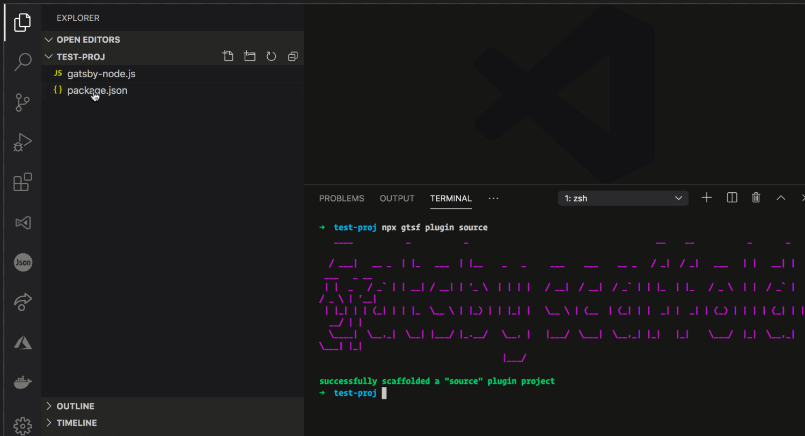

[](https://www.npmjs.com/package/gatsby-scaffolder)
[](https://www.npmjs.com/package/gatsby-server)
[](http://opensource.org/licenses/MIT)

A command line tool that scaffolds different files and projects when working with Gatsby.



## Install

- **Global install**, Either install as a global library:

    ```
    npm install -g gatsby-scaffolder
    ```

    This will install an executable `gtsf`.

- **Run with NPX**
Or run it with NPX, like so:

    ```
    npx gtsf <command> <arg>
    ```

## Commands

NOTE, the commands `component` and `page` assume there is an existing Gatsby project scaffolded already. (Thereby existing directories `src/components/` and `src/pages/`). The `plugin` command assumes you are standing in an empty directory when running it.

The following commands are supported

- `component`

    ```
    npx gtsf component <component name>
    ```

    example

    ```
    npx gtsf component hello
    ```

    This creates the React component `hello.js` in the `Components/` dir.
- `page`

    ```
    npx gtsf page <component name>
    ```

    example

    ```
    npx gtsf page hello
    ```

    This creates the React component `hello.js` in the `Pages/` dir.
- `plugin source`

    ```
    npx gtsf plugin <type>
    ```

    example

    ```
    npx gtsf plugin source
    ```

    This creates scaffolds out a new source plugin. This includes `package.json` and `gatsby-node.js`.
- `plugin transform`

  ```
  npx gtsf plugin <type>
  ```

  example

  ```
  npx gtsf plugin transform
  ```

  This scaffolds out a new transformer plugin. This includes `package.json`, `gatsby-node.js`, `parseContent.js` and a test directory.
